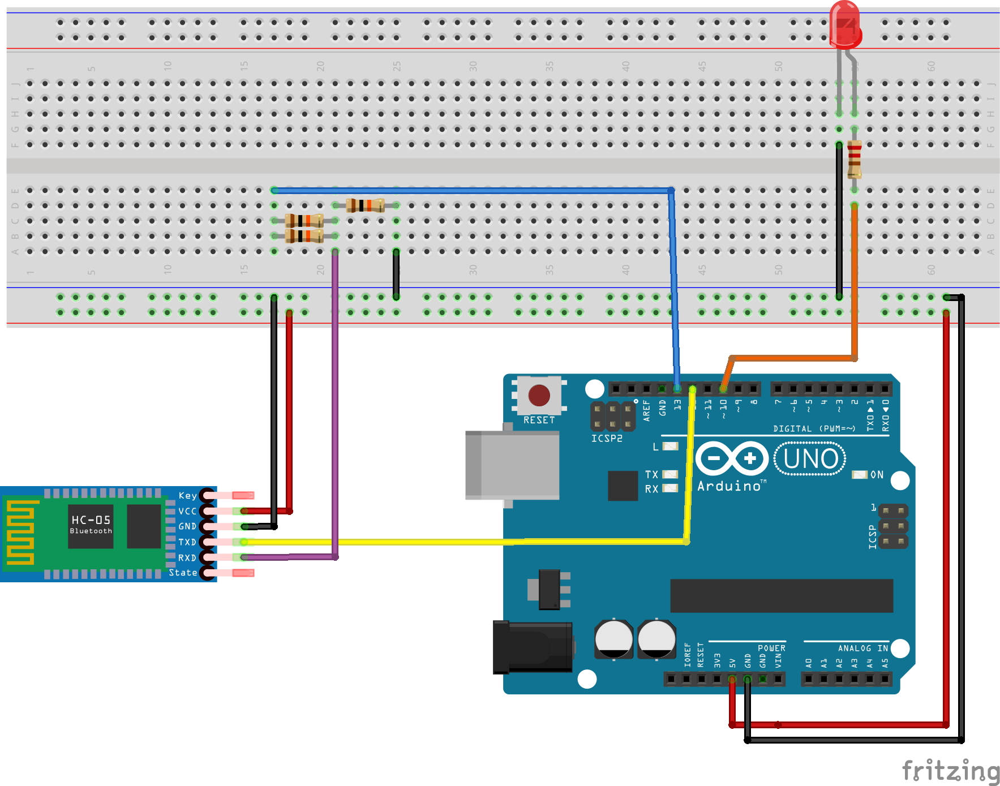

### BT Signal
BT Signal listens to bluetooth messages in order to power on/off a led and replies with its status.

The HC-06 module is in charge of the bluetooth messaging and it communicates with Arduino One like a serial port, Arduino One manages the logic for messages dispatching, led activation and overall status.

Arduino One and HC-06 module have different voltages for high value, respectively 5V and 3.3V so a little adapting is needed:
- HC-06 TXD pin transmits 3.3V to Arduino One 12 pin, the Aduino board recognizes 3.3V as high value so a direct wiring is possible
- HC-06 RXD pin receives from Arduino One 13 pin, 5V is too high and can damage the module so a voltage divider is needed. To lower the 5V to a valure near to 3.3V the voltage divider is made up by two parallel 10k ohm resistors in series with another 10k ohm resistor. 

### Components
- LED Red
- Resistor 220 Ohm
- Resistor 10k Ohm x3
- Arduino Uno board or equivalent (I used Elegoo Uno R3)
- HC-06 Bluetooth Module (in the image an HC-05 is used, the pinout is the same except the State and the Key pin) 

### Breadboard

### BT Signal App
BT Signal app is a android application made with flutter for interacting with BT signal hardware.

More info [here](./bt_signal_app/README.md)
