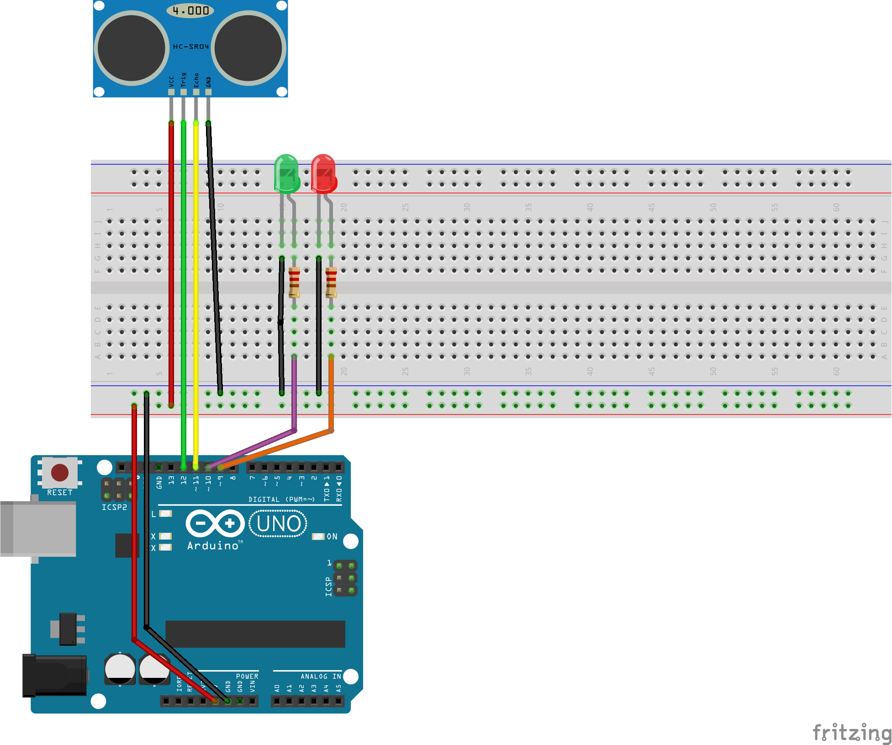

### Distance Alarm
Distance alarm acts as a semaphore driven by object distance to the sensor.

As long as there are no objects near to distance sensor, the green led is on and the red one is off. If an object comes too near to the sensor, the red led switches on and the green one switches off.

Arduino board gets input from the distance sensor and after some control loop logic sends output to the leds.

###Components
- LED Red
- LED Green
- Resistor 220 Ohm - x2
- Arduino Uno board or equivalent (I used Elegoo Uno R3)
- HC-SR04 Distance Sensor

###Breadboard

