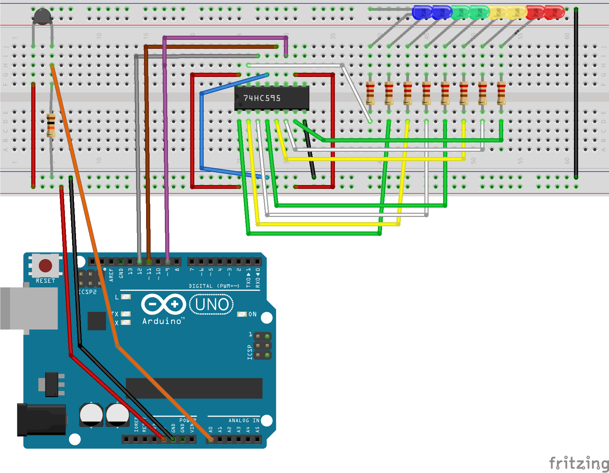

### Heat Alarm
Heat alarm acts as thermometer showing temperature on 8 leds of different colors (blue, green, yellow, red).

As temperature increases, heat alarm switches more leds on, going from the coolest color to the warmest one.

Leds are of different colors blue (coolest), green, yellow, red(warmest), when detected temperature increases the leds sw semaphore driven by object distance to the sensor.

Arduino board gets input on from the thermistor on an analogic pin and after some control loop logic sends output to the leds. For reducing wires between board and leds, arduino sends output to a shift register which multiplies it to the leds. 

### Components
- LED Red - x2
- LED Yellow - x2
- LED Green - x2
- LED Blue - x2
- Resistor 220 Ohm - x8
- Resistor 10k Ohm
- Thermistor
- 74HC595 Shift Register
- Arduino Uno board or equivalent (I used Elegoo Uno R3)

### Breadboard

