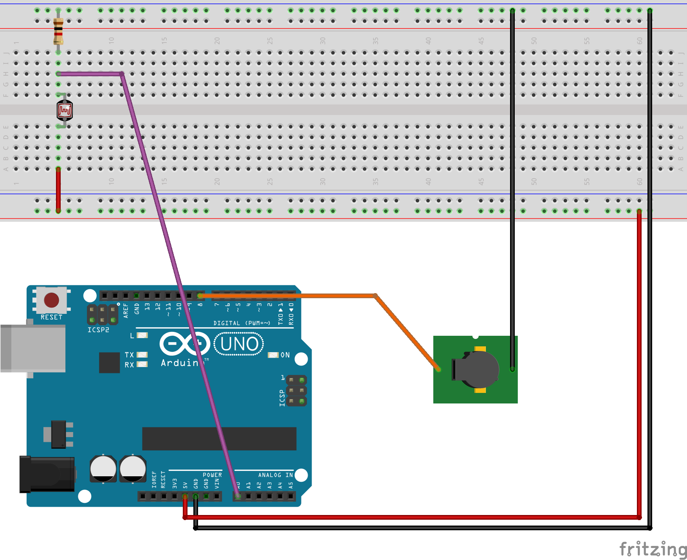

### Photo Alarm
Photo alarm activates a sound alarm if a strong light is detected.

As long as the light intensity is beyond a threshold set in the program there are no sounds from the circuit, if the light intensifies the buzzer starts to play.

Arduino board gets analogic input from the photocell (photo resistor) and after some control loop logic sends digital output to the buzzer.

### Components
- Photo-Resistor
- Resistor 1k Ohm
- Active Buzzer
- Arduino Uno board or equivalent (I used Elegoo Uno R3)

### Breadboard

